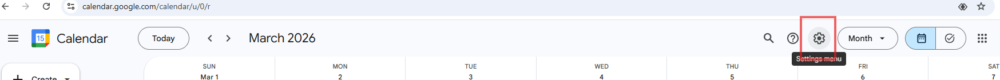
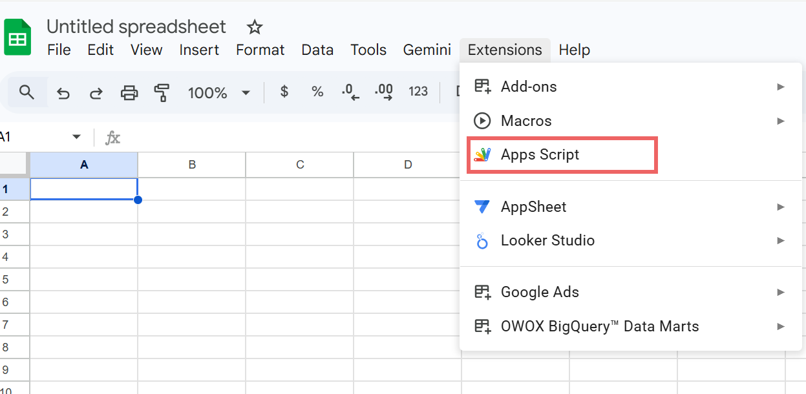
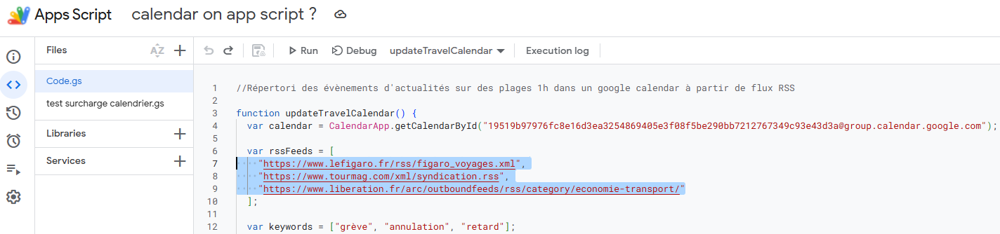
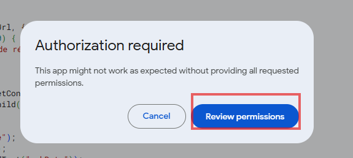

# How to use the script

## Setup takes only a few minutes:
* Find your Calendar ID in your google calendar. 
Create a Google Calendar dedicated to monitoring and find your Calendar ID by clicking setting->your name at left side ->CalendarID 

* Open a new google sheet and open Google Apps Script

* Paste the [script](Appscript_rss_calendar.js)

* Replace the Calendar ID

* Add or modify RSS sources if you want

* Run by order functions by clicking Run sign at top

* Consent for authorization

Once running, the script will continuously **populate your calendar with relevant travel disruption news**.

